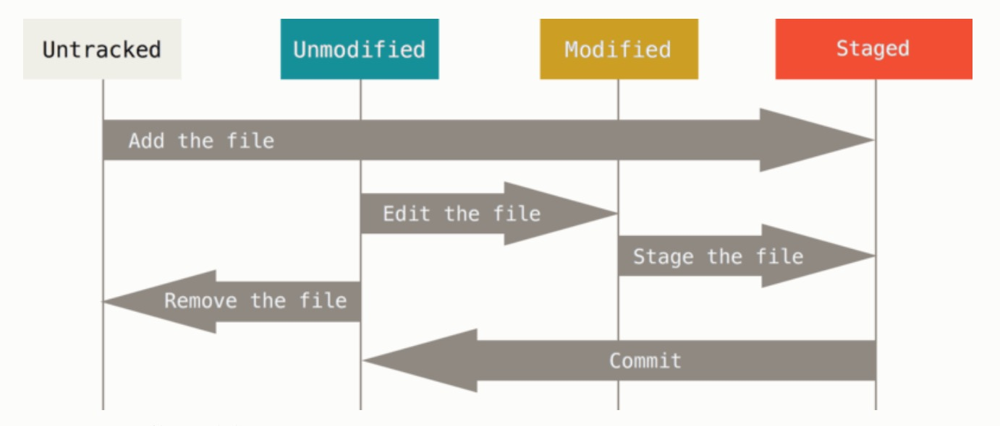

# Git 基础

Git 基础，即学会一个基本的Git使用流程和一些基本概念。主流程包括获取仓库、提交修改、推送修改、撤销修改。以及辅助的打标签，修改远程仓库地址功能。

## 2.1 获取 Git 仓库

有两种获取Git仓库的方式：

* 在现有项目或者目录下导入所有文件到Git中；
* 从一个服务器克隆一个现有的Git仓库

### 从现有目录中初始化仓库

在项目目录下打开git命令行工具，执行init操作

	$ git init

该命令将会创建一个名为 .git 的目录，这个目录包就是Git仓库的主文件夹。存放着文件跟踪的所有信息。

### 克隆仓库

如果你获得一份已经存在的Git仓库的拷贝，可以使用 git clone 命令，来拉取 Git 仓库的几乎所有文件，包括每一个文件的每一个版本。这也正是Git的一大特性，通过克隆，你可以得到一个和远程仓库一样的本地仓库，就像复制粘贴一样。此时，这个仓库就是你自己的花园，你可以随意修剪。

	$ git clone https://github.com/libgit2/libgit2
	

Git 支持多种数据传输协议。 上面的例子使用的是 https:// 协议，不过你也可以使用 git:// 协议或者使用 SSH 传输协议，比如 user@server:path/to/repo.git

## 2.2 记录每次更新到仓库

每一个文件都不外乎这两种状态：**已跟踪或未跟踪**。**已跟踪的文件**是指那些被纳入了版本控制的文件，在上一次快照中有它们的记录，在工作一段时间后，它们的状态可能处于未修改，已修改或已放入暂存区。 工作目录中除已跟踪文件以外的所有其它文件都属于**未跟踪文件**，它们既不存在于上次快照的记录中，也没有放入暂存区。所谓的更新就是文件的状态更新。

一个文件的总是从未跟踪到已跟踪，从已修改到已暂存到已提交，然后再从已提交到已暂存再到已提交，如次循环。或者删除文件，退出跟踪。生命周期图如下

###通过 git status 命令，我们可以查看仓库中文件的状态。

	$ git status
	On branch master // 当前所在分支
	Your branch is up to date with 'origin/master'. //当前分支的状态

	Changes to be committed://待提交的修改（已暂存）
  	(use "git reset HEAD <file>..." to unstage)

	modified:   Git/Git 基础.md

	Changes not staged for commit:待暂存的修改（已修改）
  	(use "git add/rm <file>..." to update what will be committed)
  	(use "git checkout -- <file>..." to discard changes in working directory)

	deleted:    Git/b.png

	Untracked files: 待追踪的文件
  	(use "git add <file>..." to include in what will be committed)

	Git/images/

###使用命令 git add 开始跟踪一个文件/暂存一个文件。

	$ git add README
	
这是个多功能命令：可以用它开始跟踪新文件，或者把已跟踪的文件放到暂存区，还能用于合并时把有冲突的文件标记为已解决状态等，git add 命令使用文件或目录的路径作为参数；如果参数是目录的路径，该命令将递归地跟踪该目录下的所有文件。

###状态简览

使用 git status -s 或者 git status --short 查看更为简洁的状态报告。

	$ git status -s
	MM "Git/Git 基础.md"
	 D Git/b.png
	?? Git/images/

?? 标记未追踪的文件，A 表示新添加追踪的文件，D 表示删除的文件，M 分为左右两种，左边的M表示修改已暂存的文件，右边的表示修改未暂存。

### 忽略文件

使用 .gitignore 配置不需要Git管理的文件。比如日志文件等临时文件。

文件 .gitignore 的格式规范如下：

* 所有空行或者以 ＃ 开头的行都会被 Git 忽略。

* 可以使用标准的 glob 模式匹配。

* 匹配模式可以以（/）开头防止递归。

* 匹配模式可以以（/）结尾指定目录。

* 要忽略指定模式以外的文件或目录，可以在模式前加上惊叹号（!）取反。

例子

	# no .a files
	*.a
	
	# but do track lib.a, even though you're ignoring .a files above
	!lib.a
	
	# only ignore the TODO file in the current directory, not subdir/TODO
	/TODO
	
	# ignore all files in the build/ directory
	build/
	
	# ignore doc/notes.txt, but not doc/server/arch.txt
	doc/*.txt
	
	# ignore all .pdf files in the doc/ directory
	doc/**/*.pdf

### 查看已暂存和未暂存的修改

使用 git diff 查看未暂存的文件的修改内容。
使用 git diff --cached 查看已暂存的文件的修改内容

	$ git diff --cached
	

### 提交已暂存的修改

使用 git commit 提交已暂存的修改

	$ git commit

然后填写提交信息。 也可以使用git commit -m “msg” 在一行命令里完成提交和信息的填写。

### 跳过使用暂存区域

有时候，提交就是要提交所有的改动， 此时要先执行 git add . 将所有文件暂存，然后在执行 git commit -m ‘msg’。这样会显得麻烦， 此时可以使用 git commit -a -m ‘msg’ 实现一行命令实现提交修改的功能。

	$ git commit -a -m ‘msg’ 

### 移除文件

在Git中当你要删除一个文件时，实际上是包含了两个删除，一是从已跟踪文件清单中移除改文件，另一个是从磁盘中，删除文件。如果你只是简单的从磁盘上删除了文件，此时你并没有从从已跟踪中删除该文件，还需要在提交一次删除操作，才能移除跟踪。

对于没有暂存过的文件， 使用 **git rm** 命令，就能在移除Git对该文件管理的同时，还能从磁盘上删除文件。

	$ git rm [文件名]

对于暂存过的文件，则需要使用 -f 强制删除选项（“译注：即 force 的首字母”）。
	
	$ git rm -f [文件名]

如果你只是想删除Git对该文件的管理，而不想从磁盘上删除改文件，可以使用 --cached 选项。
	
	
	$ git rm --cached README

利用这个特点，我们可以实现移除Git对某文件的管理（亦即从暂存区域移除），但是仍然在磁盘上保留该文件。换句话说，你想让文件保留在磁盘，但是并不想让 Git 继续跟踪。 **当你忘记添加 .gitignore 文件，不小心把一个很大的日志文件或一堆 .a 这样的编译生成文件添加到暂存区时，这一做法尤其有用。** 为达到这一目的，使用 --cached 选项：

git rm 命令后面可以列出文件或者目录的名字，也可以使用 glob 模式。

	$ git rm log/\*.log //删除log文件夹下所有 .log 结尾的文件。
	$ git rm \*~  // 删除文件夹下所有文件。
	

### 移动文件

Git 并不显式跟踪文件移动操作。 如果在 Git 中重命名了某个文件，仓库中存储的元数据并不会体现出这是一次改名操作。

要在 Git 中对文件改名，可以这么做：

	$ git mv file_from file_to

运行 git mv 就相当于运行了下面三条命令：

	$ mv README.md README
	$ git rm README.md
	$ git add README

如此分开操作，Git 也会意识到这是一次改名，所以不管何种方式结果都一样。 两者唯一的区别是，mv 是一条命令而另一种方式需要三条命令，直接用 git mv 轻便得多。 不过有时候用其他工具批处理改名的话，要记得在提交前删除老的文件名，再添加新的文件名。

## 2.3 查看提交历史

使用 git log 查看提交历史。默认不用任何参数的话，git log 会按提交时间列出所有的更新，最近的更新排在最上面。

	$ git log
	

git log 命令还可以通过添加参数来对输出的日志进行过滤和处理。下面是一些常用的操作：

* -p 用来显示每次提交的内容差异。
	
		$ git log -p
	
* -2 只显示最近两次的提交日志。

		$ git log -2
		$ git log -p -2 //或者同时使用两个参数
		
* --stat 显示每次更新的文件修改统计信息（文件更新个数，增删内容及位置简略，提交信息）。
	
		$ git log -1 --state 
		commit d913191e6b7c9eb8192a97536b2943543b4b0e14
		Author: MX <mx@MX-Mac.lan>
		Date:   Thu Jul 19 23:06:16 2018 +0800

   	 	获取仓库、修改、修改文件名、忽略文件、提交、查看状态

 		Git/Git 基础.md | 133 +++++++++++++++++++++++++++++++++++++++++++++++++++++-
 		Git/b.png         | Bin 62173 -> 0 bytes
 		2 files changed, 131 insertions(+), 2 deletions(-)
	
* --pretty 这个选项可以指定不同于默认格式的方式显示提交历史。

	这个选项还可以在指定其子选项。用于配置指定的格式。online 命令用于指定将每个提交的日志显示在一行。

		$ git log --pretty=online 
	
	formate 可以实现更高度的定制，例如：
	
		$ git log --pretty=formate"%h -  %an, %ar : %s"
		formate5da884d -  MX, 2 days ago : 图片文件夹
		formated913191 -  MX, 2 days ago : 获取仓库、修改、修改文件名、忽略文件、提交、查看状态
		formatec75911d -  MX, 2 days ago : 0
		formate6f070e5 -  gumengxiao, 2 days ago : 0
		formate5c9689d -  gumengxiao, 2 days ago : 0
		formateff298cd -  gumengxiao, 2 days ago : Git 简介、基础
		formate49cfa6a -  星辰, 2 days ago : Initial commit

	这个格式的指定方式有很多种， 具体的还是看官方的文档吧， 这里就补贴出来了，实在是太多了。 不过这个例子倒是个不错的用例。
	
* --graph 用于展示分支和合并历史。

* git log 加文件名或者文件夹名， 查看指定文件或者文件夹的变更日志。

git 的日志输出配置当人不仅仅是这些，还有更多详细的，但是不怎么常用，却又很有用的操作， 就不一一列出了，还是用的时候直接去翻看官网吧。

## 2.4 撤销操作

	

## 2.5 远程仓库的使用

## 2.6 打标签

## 2.7 Git 别名

## 2.8 总结

