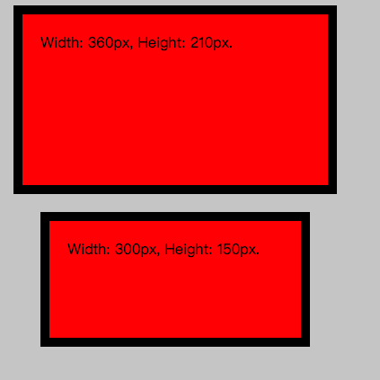
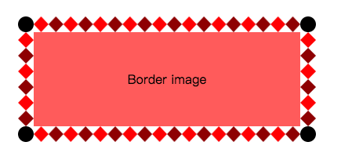

这一章讨论对盒子本书进行样式化，包括操作盒子的背景颜色、图像、边框、和其他部分。


# 1. 盒子模型概要


### 1.1 盒子的属性

再次重述盒子的模型：

* width 和 height 设置了内容库的款/高
* padding 设置了内边距的宽度
* border 设置了边界的宽度、颜色、样式。
* margin 设置额包围 css 盒子外部区域的宽度。


重申一些特性：

* 如果盒子的高度被设置为百分比长度，那么盒子不会遵循这个设置了的百分比长度，而是采用盒子内容的高度，除非给她设置了一个绝对高度。
* 边界会忽略百分比的宽度设置。
* 外边界有一个特殊的行为，称为一个外边界塌陷。


#### 溢出（overflow）

#### 背景裁剪（background-clip）

#### 轮廓（outline）

outline 看起来像边框，但是它并不是盒子模型的一部分。outline是画在外边框之外，外边框区域之内。


### 1.2 盒子的高级属性


#### 设置宽和高的约束

min-width、max-width、min-height、max-height。


#### 完全改变盒模型

原本的盒子总宽度是 width， padding-right，padding-left，border-right和border-left的和。可以通过修改 border-box 来将盒子的总宽度变为 width 本身。

记下同样的设置下，效果如下

```html
<div class="one"></div>
<div class="two"></div>
```

```css
html {
  font-family: sans-serif;
  background: #ccc;
}

.one, .two {
  background: red;
  width: 300px;
  height: 150px;
  padding: 20px;
  border: 10px solid black;
  margin: 20px auto;
}

.two {
  box-sizing: border-box;
}
```

```js
var one = document.querySelector('.one');
var two = document.querySelector('.two');

function outputWH(box) {
  var width = box.offsetWidth;
  var height = box.offsetHeight;
  box.textContent = 'Width: ' + width + 'px, Height: ' + height + 'px.'
}

outputWH(one);
outputWH(two);
```




### 1.3 盒子显示类型


#### 常见的显示类型

* 块盒（block box）
* 行内盒（inline box）
* 行内块盒 （inline-block box）

#### 不常见的显示类型

* display:  table    ——    允许你像处理 table 布局那样处理非 table 元素，而不是滥用 HTML 的 table 标签来达到同样的目的。
* display:  flex    ——    弹性布局
* display:  grid    ——    一种实现 CSS 网格系统的方式。


# 2. 背景

### 2.1 基本属性

背景的区域是：元素内容、元素内边距和边界下层区域。默认是这样的，但是可以通过 background-clip 来修改背景所占的区域。

基本属性：

- [`background-color`](https://developer.mozilla.org/zh-CN/docs/Web/CSS/background-color): 为背景设置一个纯色。
- [`background-image`](https://developer.mozilla.org/zh-CN/docs/Web/CSS/background-image): 指定在元素的背景中出现的背景图像。
  这可以是静态文件，也可以是生成的渐变。
- [`background-position`](https://developer.mozilla.org/zh-CN/docs/Web/CSS/background-position):指定背景应该出现在元素背景中的位置。
- [`background-repeat`](https://developer.mozilla.org/zh-CN/docs/Web/CSS/background-repeat): 指定背景是否应该被重复(平铺)。
- [`background-attachment`](https://developer.mozilla.org/zh-CN/docs/Web/CSS/background-attachment): 当内容滚动时，指定元素背景的行为，例如，它是滚动的内容，还是固定的?
- [`background`](https://developer.mozilla.org/zh-CN/docs/Web/CSS/background): 在一行中指定以上五个属性的缩写。
- [`background-size`](https://developer.mozilla.org/zh-CN/docs/Web/CSS/background-size): 允许动态调整背景图像的大小。


### 2.2 背景图像：渐变


#### 颜色渐变（linear-gradient）

```css
div {
background-image: linear-gradient(to bottom, orange, yellow);
}
```


### 2.3 背景附着（background-attachment）


### 2.4 背景简写

```css
div {
background: yellow linear-gradient(to bottom, orange, yellow) no-repeat left center scroll;
}
```


### 2.5 多个背景（IE9开始支持）

```html
div {
background: url(image.png) no-repeat 99% center,
            url(background-tile.png),
            linear-gradient(to bottom, yellow, #dddd00 50%, orange);
background-color: yellow;
}
```


### 2.6 背景尺寸


# 3. 边框


### 3.1 回顾

#### 边界简写

```css
p {
  padding: 10px;
  background: yellow;
  border: 2px solid red;
}
```


具体分解如下：

- [`border-top`](https://developer.mozilla.org/zh-CN/docs/Web/CSS/border-top), [`border-right`](https://developer.mozilla.org/zh-CN/docs/Web/CSS/border-right), [`border-bottom`](https://developer.mozilla.org/zh-CN/docs/Web/CSS/border-bottom), [`border-left`](https://developer.mozilla.org/zh-CN/docs/Web/CSS/border-left): 设置边界一侧的宽度，样式和颜色。
- [`border-width`](https://developer.mozilla.org/zh-CN/docs/Web/CSS/border-width), [`border-style`](https://developer.mozilla.org/zh-CN/docs/Web/CSS/border-style), [`border-color`](https://developer.mozilla.org/zh-CN/docs/Web/CSS/border-color): 设置边界宽度、样式或颜色，但是会设置边界的四个边。
- 您还可以单独三个属性中的一个并且设置其中一侧边界生效。
  [`border-top-width`](https://developer.mozilla.org/zh-CN/docs/Web/CSS/border-top-width), [`border-top-style`](https://developer.mozilla.org/zh-CN/docs/Web/CSS/border-top-style), [`border-top-color`](https://developer.mozilla.org/zh-CN/docs/Web/CSS/border-top-color)等


### 3.2 边界半径（border-radius）

写法如下:

```css
border-radius: 20px 10px;
border-radius: 20px 10px 50px;
border-radius: 20px 10px 50px 0;
```


### 3.3 边界图像

```css
border-image-source: url(border-image.png);//设置边界图像
border-image-slice: 40;//设置边界图像切片
border-image-repeat: round;//设置边界图像的填充模式

<--不常用!-->
border-image-width：10px;//设置边界图像的宽度
border-image-outset：10px;//定义边界内部和内边距之间的额外空间的大小
```


border-image-repeat的值讲解：

- `stretch`：默认;侧面的图像被拉伸来填满边界。这通常看起来很糟糕和像素化，所以不推荐。
- `repeat`：边图像被重复，直到边界被填满。根据具体情况，这可能看起来不错，但您可能会看到一些难看的图像片段。
- `round`： 边的图像被重复，直到边界被填满，它们都被稍微拉伸，这样就不会出现碎片。
- `space`：边图像被重复，直到边界被填满，每个拷贝之间添加了少量的间隔，这样就不会出现任何片段。这个值只在Safari(9+)和Internet Explorer(11+)中得到支持。


效果如下：




# 4. 样式化表格


# 5. 高级盒子效果

这一部分包括：盒子影子，混合模式和过滤器


### 5.1 盒子影子（box-shadow）

用例：

```css
.simple {
  box-shadow: 5px 5px 5px rgba(0,0,0,0.7);
}
```

box-shaow 的四个值：

1. 第一个长度值是水平偏移量（**horizontal offset** ）——即向右的距离，阴影被从原始的框中偏移(如果值为负的话则为左)。
2. 第二个长度值是垂直偏移量（**vertical offset**）——即阴影从原始盒子中向下偏移的距离(或向上，如果值为负)。
3. 第三个长度的值是模糊半径（**blur radius**）——在阴影中应用的模糊度。
4. 颜色值是阴影的基本颜色（**base color**）


#### 可以对盒子设置多个阴影：

如下

```css
.multiple {
  box-shadow: 1px 1px 1px black,
              2px 2px 1px black,
              3px 3px 1px red,
              4px 4px 1px red,
              5px 5px 1px black,
              6px 6px 1px black;
}
```


#### 盒子阴影的其他特性

box-shaow 的 inset 关键字可以让阴影变成内部阴影。

```css
button:active {
  box-shadow: inset 2px 2px 1px black,
              inset 2px 3px 5px rgba(0,0,0,0.3),
              inset -2px -3px 5px rgba(255,255,255,0.5);
}
```


### 5.2  Filters（过滤器）

滤镜，强大的功能，具有更多属性，需要在用的过程总探索。

1　　grayscale灰度

2　　sepia褐色（有种复古的旧照片感觉）

3　　saturate饱和度

4　　hue-rotate色相旋转

5　　invert反色

6　　opacity透明度

7　　brightness亮度

8　　contrast对比度

9　　blur模糊


### 5.3 Blend modes （混合模式）

mix-blend-mode, 用来将一个元素与它覆盖的那些元素各自所设置的背景（background）和内容(content)混合在一起。