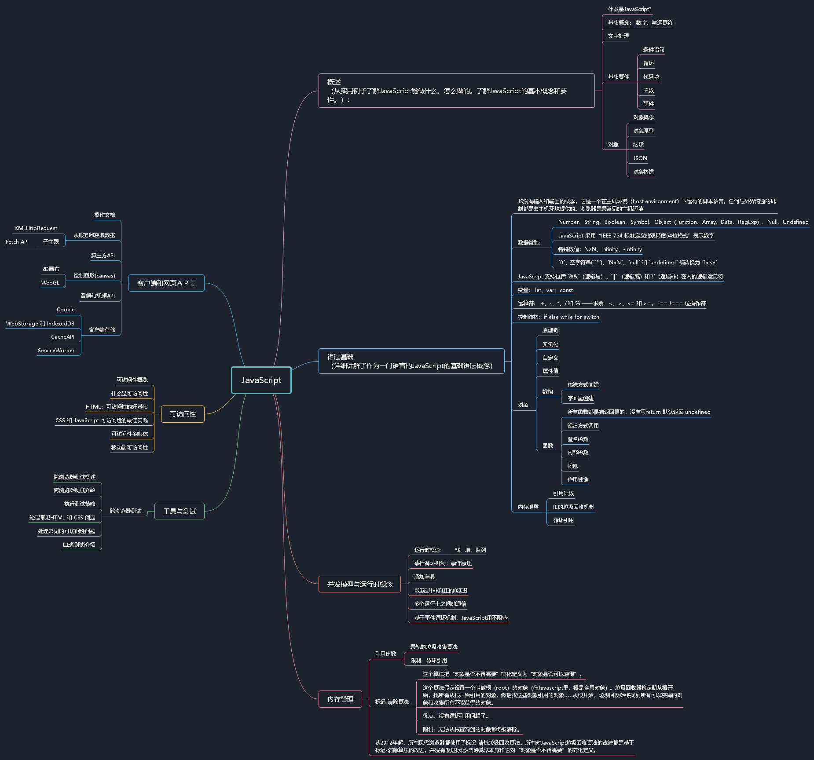

标准Web技术：

- [HTML](https://developer.mozilla.org/en-US/docs/Glossary/HTML)是一种标记语言，用来结构化我们的网页内容并赋予内容含义，例如定义段落、标题和数据表，或在页面中嵌入图片和视频。
- [CSS](https://developer.mozilla.org/en-US/docs/Glossary/CSS) 是一种样式规则语言，可将样式应用于 HTML 内容， 例如设置背景颜色和字体，在多个列中布局内容。
- [JavaScript](https://developer.mozilla.org/en-US/docs/Glossary/JavaScript) 是一种脚本语言，可以用来创建动态更新的内容，控制多媒体，制作图像动画，还有很多。（好吧，虽然它不是万能的，但可以通过简短的代码来实现神奇的功能。）


# 1. 什么是JavaScript


### 1.1 广义定义：


JavaScript 是一种脚本语言，一门编程语言，他可以在网页上实现复杂的功能，网页展示给你的不再是简单的静态信息，实时的内容更新，交互式的地图，2D/3D动画，滚动播放视频等。


### 1.2 它到底可以做什么？


JavaScript 语言的核心包括一些普遍的编程特性，可以让你实现诸如变量操作，字符操作，响应页面时间等功能。

在核心之上的构建（**应用程序接口（API）**）则能够提供更为丰富的功能。API通常分为两类：浏览器API和第三方API。

浏览器API内建与web浏览器中，提供诸如文档对象模型API，地址位置API，画布API等功能。

第三方则是类似于JQuery等第三方框架。


### 1.3 JavaScript 在页面上做了什么？


浏览器在读取一个网页时，首先将 HTML和 CSS 组装成一个网页，然后生成DOM。之后浏览器的JavaScript引擎将会执行JavaScript代码。

#### 浏览器安全

每一个浏览器标签页都是一个独立的容器。以此实现隔离保证安全。

#### JavaScript 运行次序

从上之下，依次执行。

#### 解释代码 vs 编译代码

编译型语言代码在运行之前需要先转化成另一个种形式。如C/C++，Java都是先编译后执行的。

相对于编译型语言。解释型语言在代码被执行前无需再编译转化为其他形式。可以直接执行。

#### ### 1.4 怎么向页面添加JavaScript

#### 内部的

在scrptt标签中编写。

#### 外部的

通过 script便签引入

#### 内联的JavaScript处理器

```html
<button onclick="createParagraph()">Click me!</button>
```


# 2. JavaScript语言中的基础要件

### 2.1 条件语句 if else

### 2.2 循环语句 

* for，break ，continue
* while do
* do while

### 2.3 函数


#### 函数与方法

**严格来说，内置浏览器函数并不是函数----它们是*方法*。**

二者的区别在于：方法是对象内定义的函数。内置浏览器功能（方法）和变量（成为属性）存储在结构化对象内，以便使代码更高效，更易于处理。

很大程度上两者是可以互换的。


#### 自定义函数

```js
function test () {
	console.log(1);
}
```


#### 匿名函数

```js
function() {
  alert('hello');
}
```


#### 函数作用域

所有函数的最外层被称为全局作用域。 在全局作用域内定义的值可以在任意地方访问。


#### 函数参数，函数返回值


### 2.4 事件介绍

事件不止是指发生在网页上的事件。而是这么一种机制--通过注册事件处理器，监听事件，并处理事件的机制。

例如nodejs的事件机制。

#### 网页上使用事件的方式

* 事件处理器属性

```js
var btn = document.querySelector('button');

btn.onclick = function() {
  var rndCol = 'rgb(' + random(255) + ',' + random(255) + ',' + random(255) + ')';
  document.body.style.backgroundColor = rndCol;
}
```


* 行内事件处理器

```html
<button onclick="alert('Hello, this is my old-fashioned event handler!');">Press me</button>
```

特点：该方法只能注册一个事件。

* ### addEventListener()和removeEventListener()

```js
var btn = document.querySelector('button');

function bgChange() {
  var rndCol = 'rgb(' + random(255) + ',' + random(255) + ',' + random(255) + ')';
  document.body.style.backgroundColor = rndCol;
}   

btn.addEventListener('click', bgChange);
```

特点：可以给一个元素绑定多个事件，并可以移除。


#### 其他事件概念


##### 事件对象（event）

##### 阻止默认行为

```js
 e.preventDefault();
```

##### 事件冒泡及捕获

```js
video.onclick = function(e) {
  e.stopPropagation();//阻止冒泡
};
```


# 3. 对象基础


### 3.1 对象基础

对象表示：

```js
var person = {};
```


#### 点表示法

```js
person.age
```


#### 括号表示法

```js
person['age']
```


#### this 的含义

关键字"this"指向了当前代码运行时的对象


### 3.2 面向对象

一个基本的OOP思想：我们想要在我们的程序中使用对象来表示现实世界模型，并提供一个简单的方式来访问他的功能。


#### 定义一个对象模板


在一些面向对想的语言中，我们用类（class）的概念去描述一个对象。在JavaScript中则使用了一个完全不同的术语来描述； ---- 类并不完全是一个对象，它更像是一个定义对象特质的模板。


#### 创建一个真正的对象


也称之为实例化 -- 实例对象被类实例化。


#### 具体的对象


### 3.3 构建函数和对象实例


JavaScript 使用一种称为**构建函数**的特殊函数来定义对象和它们的特征。

不像“经典”的面向对象的语言，从构建函数创建的新实例的特征并非完全复制，而是通过一个叫原型链的参考链接过去的。所以并非真正的实例，严格来讲，JavaScript在对象间使用和其他语言的共享机制不同。


#### 一个简单的例子

```js
function Person(name) {
  this.name = name;
  this.greeting = function() {
    alert('Hi! I\'m ' + this.name + '.');
  };
}
```

```js
var person1 = new Person('Bob');
var person2 = new Person('Sarah');
```


此时 Person 函数不需要返回值。


#### 创建对象实例的其他方法


上边介绍了两种创建对象实例的方法：

* 声明一个对象的语法
* 使用构造函数


下面介绍几种不一样的方法：

#### Object() 构造函数

```js
var person1 = new Object();
person1.name = 'Chris';
```

或者设置一些初始值

```js
var person1 = new Object({
  name : 'Chris',
  age : 38,
  greeting : function() {
    alert('Hi! I\'m ' + this.name + '.');
  }
});
```

#### 使用 create() 方法

JavaScript  有个内嵌的方法 create()，它允许您基于现有的对象创建新的对象实例。

```js
var person2 = Object.create(person1);
```


**new 操作符 和 create 方法创建对象的原理是不同的， 通过new操作符 会创建一个拥有 这个类的所有属性和方法的实例。 create 则是直接创建 一个新的对象，然后将原型指向模板对象。不过表面上的使用并不会有区别。**


### 3.4 对象原型

通过原型这种机制，JavaScript 中的对象从其他对象继承功能和特性；这种继承机制与经典的面向对象编程语言的继承机制不同。


#### 基于原型的语言？


JavaScript 常被描述为一种基于原型的语言：每个对象拥有一个**原型对象**，对象以其原型为模板、从原型继承方法和属性。原型对象也可能拥有原型，并从中继承方法和属性，一层一层、以此类推。这种关系常被称为**原型链 (prototype chain)**，它解释了为何一个对象会拥有定义在其他对象中的属性和方法。


准确地说，这些属性和方法定义在Object的构造器函数(constructor functions)之上的`prototype`属性上，而非对象实例本身。

 

**在实例化一个对象时，原型链上定义的属性和方法，并不会被拷贝到实例化的对象上，而是通过一种机制提供了访问能力。**


原型只是让一个对象拥有了读取其原型对象上的方法和属性的能力。


### 3.5 原型式继承


JavaScript 通过原型链实现继承： 继承的对象函数并不是通过复制而来的，而是通过原型链继承的。

#### 一个实现继承的例子：

```js
function Teacher(first, last, age, gender, interests, subject) {
  Person.call(this, first, last, age, gender, interests);

  this.subject = subject;
}
```


这个例子中通过 call 函数实现实现了 使 Theacher 对象拥有Person所拥有的属性和方法。

#### 通过设置 Teacher() 的原型和构造器引用实现继承

```js
Teacher.prototype = Object.create(Person.prototype);
Teacher.prototype.constructor = Teacher;
```


#### 对象成员总结


1. 那些定义在构造函数中，用于给予对象实例的。  例如 this.x = x;他们是可用于对象实例的成员。
2. 那些直接在构造函数上定义，尽在构造函数上可用的。这些通常仅在内置的浏览器对象中可用，并通过被直接连接到构造函数，而不是实例来识别。
3. 那些在构造函数原型上定义，由所有实例和对象继承的。例如 myConstructor.prototype.x().


### 3.6  JSON


JavaScript 对象表示法（JSON）是用于将结构数据表示为JavaScript对象的标准格式，通常用于在网站上标识和传输数据。

JSON 基于 JavaScript 但是独立于 JavaScript。

两个函数： JSON.parse() 解析JSON字符串   JSON.stringify() 将对象转为字符串